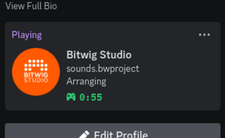

# bitwig-presence

Simple Discord Rich Presence integration for Bitwig Studio - shows what project you're working on, what panel you're in (arranger, mixer, editor), and how long you've been working on it.

## Usage

Download the `.bwextension` file from the [releases page](https://github.com/Merlin04/bitwig-presence/releases) and copy it into your `Extensions` folder. 

Then, go to `Settings -> Controllers` and add the controller (vendor "Discord", product "Discord RPC"). It will appear as a little keyboard icon in the upper right corner of the window - click that to open a settings panel which lets you turn it on and off.